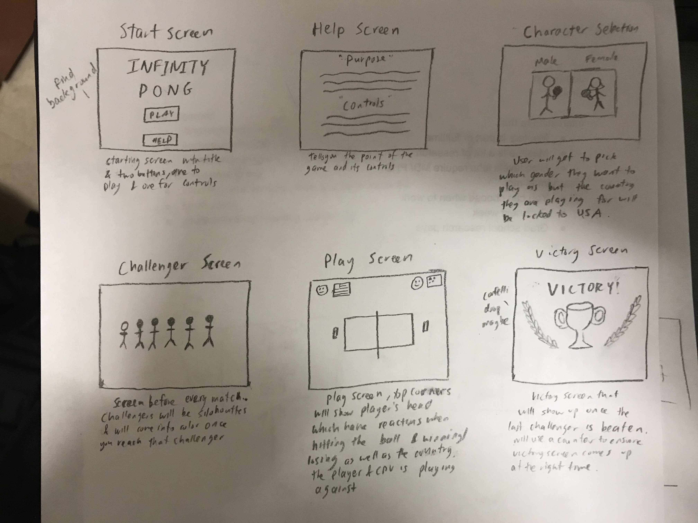
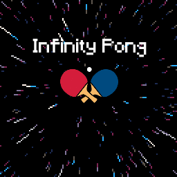
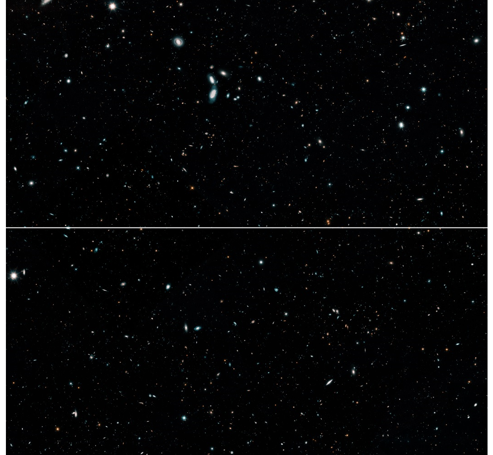
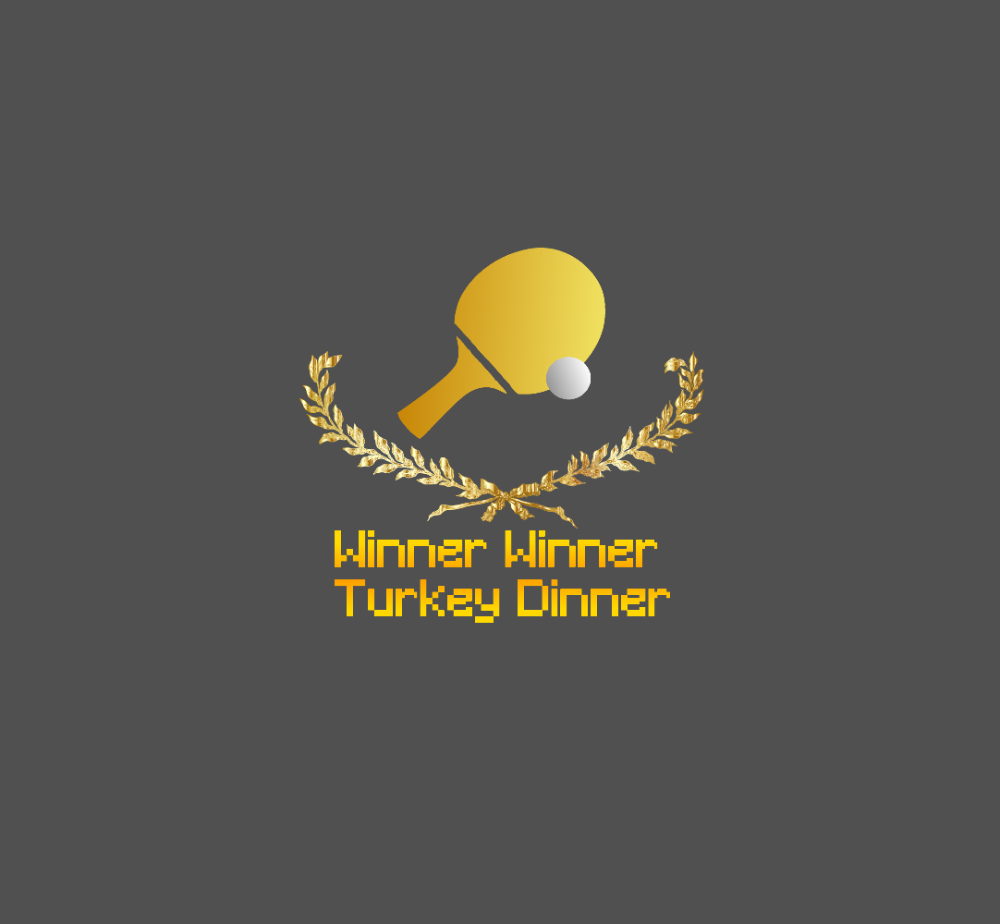
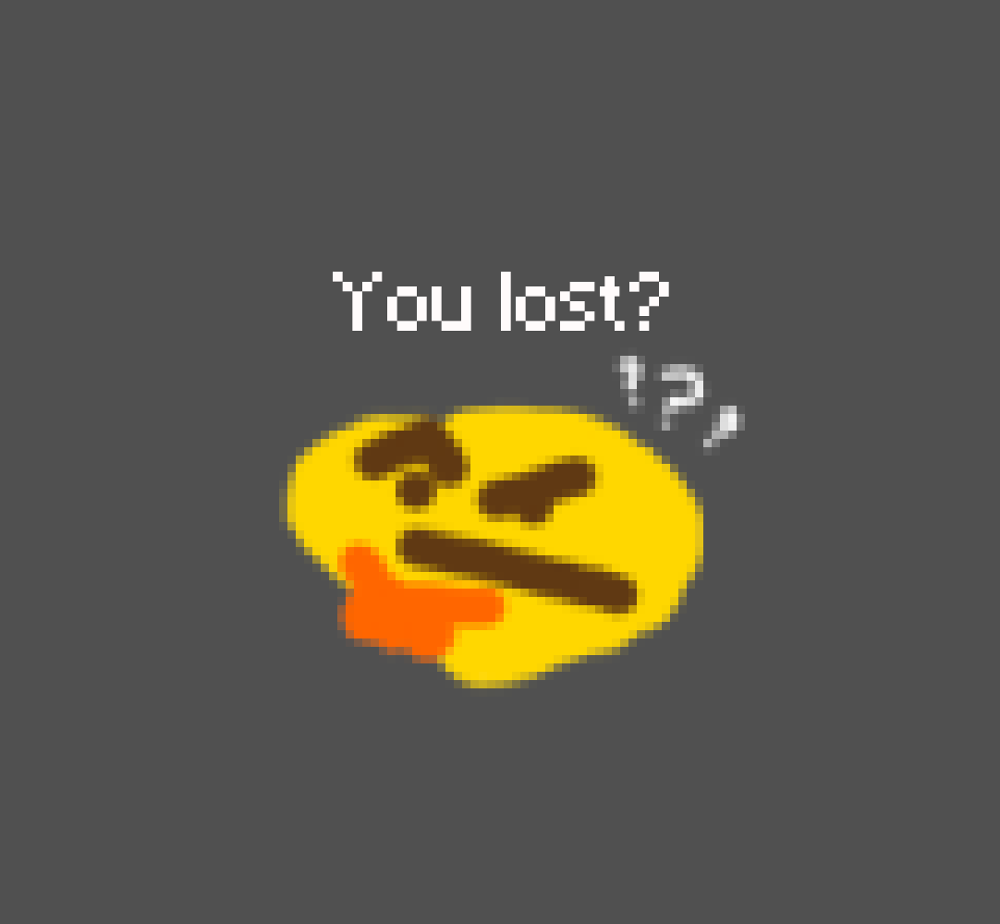
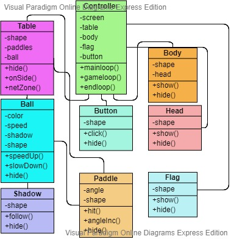

:warning: Everything between << >> needs to be replaced (remove << >> after replacing)

# Pong
## CS 110 Final Project
### 1st semester, 2019
### [Assignment Description](https://drive.google.com/open?id=1HLIk-539N9KiAAG1224NWpFyEl4RsPVBwtBZ9KbjicE)

https://github.com/bucs110/final-project-fall19-ping-pong-bois.git

https://docs.google.com/presentation/d/1TWBFFyGNKGuWb6dXQsHYrUvoL0zmub2yzpJmd7VnHyA/edit?usp=sharing

### Team: ping pong bois
#### Andy Liu, Jeffrey Lin, Donal George

***

## Project Description
Our project is a game consisting of a combination between the classic game pong,and ping pong. The user will play against a "AI" we created, and attempts to score point.
***    

## User Interface Design
*  
* TBD
# 1. Main Screen
   The main screen allows the user to start the game or check the instructions to play the game.
    
# 2. Game screen
   This is where the actual game takes place when you click on the play button. The ball should bounce off the side of the wall,
   as well as the paddles. If the "AI" misses or hits the net, you gain a point. If the user misses or hits the net, "AI" gains
   the point. When the player beats all the "AI," a congratulation screen will appear. Otherwise, you will be shown the Game Over
   Screen.
   
# 3. Congratulation screen
   This screen will appear once the user has defeated all the "AI." 
   
# 4. Game Over screen
   This screen will appear when the user loses.
   
***        

## Program Design
* 
* Non-Standard libraries
    * pygame
    * For each additional module you should include
        * url for the module documentation
        * a short description of the module
* Class Interface Design
    * TBD
* Classes
    ball- A class that defines the ball- The ball sprite bounces
    button-
    controller-
    flag-
    net-
    paddle-

***

## Tasks and Responsibilities
* You must outline the team member roles and who was responsible for each class/method, both individual and collaborative.

### Software Lead - Andy Liu

Makes sure the members are on task, development of movement within the game.

### Front End Specialist - Jeffrey

*most likely pygame

### Back End Specialist - Donal George

TBD

## Testing
* TBD
    * TBD

* Your ATP

| Step                  | Procedure     | Expected Results  | Actual Results |
| ----------------------|:-------------:| -----------------:| -------------- |
|  1  | Run Controller()  | 1)Main Screen is Functional 2)Music playing |   
|  2  | click Instructions button  | 1)Music Continues to Play 2) displays necessary instructions needed to play the game 3) music is not affected|               
|  3  | Click escape on keyboard| 1)Goes from the instructions screen to the Main menu 2)goes from the game screen to main menu 3) goes from congratulation/ game over screen to main screen
|  4  | Click Play Button| 1) goes to game screen 2)Main menu music stops, gameplay music starts|
|  5  | Moves Mouse| 1) paddle moves relative to mouse movement 2) when padde comes in contact with ball, ball bounces off paddle|
|  6  | General Playtesting| 1) ball bounces off the side of the screen 2) "oppenent" will move to ball and reflect the ball back 3)once player returns the ball 5 times, speeds up ball 3) if ball hits net or the top/ bottom end of the screen, it counts as a miss |
|  7  | progressing to a win state| 1)If opponement misses, gains a point on the counter 2)When player reaches 11, moves on to new opponement 3)once player beats 5 opponents, players wins
|  8  | progressing to a fail state|  1) if player misses or hits net, opponent gains point. 2) if opponment reaches 11 points before player, player loses|
|  9  | Win state| Displays a congratulation screen
| 10  | fail state| Displays a game over screen
